# 大一招新考核 · 进阶挑战第 1 题：用 PySpice 完成三个电路

> 本题要求用 **PySpice** 完成三个电路：**① RC 滤波电路、② 验证戴维南定理、③ NMOS 共源级放大电路**，
> 每个电路都要有「自画电路图 + 手算过程 + PySpice 仿真数据 + 理论值 vs 仿真值对比表」。
> 本仓库即该题的全部交付物：3 个可独立运行的 `.py`、13 张自动生成的图、3 份仿真数据报告，以及本 README。

---

## 1. 项目做了什么

| # | 电路 | 手算内容 | 仿真内容 | 交付图 |
|---|---|---|---|---|
| ① | RC 低通滤波（R = 1 kΩ, C = 1 μF） | τ = RC、fc = 1/(2πRC)、传递函数、−20 dB/十倍频程、−45°/−90° 相位 | AC 扫描（1 Hz–1 MHz）求 −3 dB 截止频率；方波瞬态（200 Hz）求充电/放电时间常数 | 电路图、波特图（幅频+相频）、方波输入/输出瞬态波形 |
| ② | 戴维南定理（V1 = 12 V/R1 = 4 kΩ，V2 = 6 V/R2 = 6 kΩ，R3 = 12 kΩ，端口 a–b） | 节点法求 V_th = 8 V、短路法求 I_sc = 4 mA、R_th = V_oc/I_sc = 2 kΩ（与 4k∥6k∥12k 互证） | 开路电压仿真、短路电流仿真、6 个负载点上「原网络 vs 等效电路」逐点对比、最大功率传输 | 含源二端网络图（标注端口）、戴维南等效电路图、负载扫描 4 联图 |
| ③ | NMOS 共源级放大（VDD = 5 V、Rg1 = 60 kΩ、Rg2 = 40 kΩ、Rd = 2 kΩ、Cb1 足够大；K = 0.8 mA/V²、V_th = 1 V、λ = 0.02 /V；Vi = 10 mV/1 kHz） | V_GS、I_D、V_DS、饱和区判断；g_m、r_o、A_v = −g_m(Rd∥r_o)（含忽略 λ / 含 λ / r_o 精确式三种口径） | 直流 `.op` 对比 I_D、V_DS；V_GS 直流扫描**反查 K 与 V_th**；瞬态看输出波形并实测增益；AC 扫描交叉验证增益 | 放大器电路图、直流通路图、小信号等效模型图、平方律验证图、瞬态波形图、增益对比图、AC 频响图 |

**所有图都由代码自动生成**（`figures/` 目录），**所有数字都来自脚本自己的输出**（`results/` 目录），
README 里的每一张对比表都是从 `results/*.txt` 原样抄过来的，没有任何手填的仿真值。

---

## 2. 文件结构

```
pyspice_circuits/
├── README.md                      本文件
├── rc_filter.py                   ① RC 低通滤波：理论 + AC/瞬态仿真 + 3 张图
├── thevenin.py                    ② 戴维南定理：理论 + 开路/短路/负载扫描 + 3 张图
├── nmos_common_source.py          ③ NMOS 共源级：手算 + OP/扫描/瞬态/AC + 7 张图
├── figures/                       全部由脚本自动生成的图（13 张）
│   ├── rc_circuit.png                     ① 电路图
│   ├── rc_bode.png                        ① 波特图（幅频 + 相频）
│   ├── rc_transient_square.png            ① 方波瞬态波形（全场 + 上升沿放大）
│   ├── thevenin_original.png              ② 含源线性二端网络（标注端口 a/b）
│   ├── thevenin_equivalent.png            ② 戴维南等效电路（接负载）
│   ├── thevenin_load_sweep.png            ② 负载扫描四联图
│   ├── nmos_cs_amplifier.png              ③ 共源级放大器电路图（按题卡）
│   ├── nmos_dc_path.png                   ③ 直流通路（Cb1 开路）
│   ├── nmos_small_signal.png              ③ 小信号等效模型
│   ├── nmos_square_law_check.png          ③ 平方律验证 + K/V_th 反查
│   ├── nmos_transient.png                 ③ 瞬态输入/输出波形（反相放大）
│   ├── nmos_gain_compare.png              ③ 增益对比柱状图
│   └── nmos_ac_bode.png                   ③ AC 频响（含 Cb1 造成的低频跌落）
└── results/                       脚本输出的原始数据（README 表格的来源）
    ├── rc_filter_results.txt              ① 对比表文本
    ├── rc_ac_sweep.csv                    ① AC 扫描原始数据（f, 幅值 dB, 相位）
    ├── rc_transient.csv                   ① 瞬态原始数据（t, vin, vout）
    ├── thevenin_results.txt               ② 对比表文本
    ├── thevenin_load_sweep.csv            ② 负载扫描原始数据
    ├── nmos_common_source_results.txt     ③ 对比表文本
    ├── nmos_vgs_sweep.csv                 ③ V_GS 扫描原始数据（含 √I_D）
    ├── nmos_ac_sweep.csv                  ③ AC 扫描原始数据
    └── nmos_transient.csv                 ③ 瞬态原始数据（t, vin, vout, vg）
```

三个 `.py` **互相独立、各自可单独运行**，不依赖任何自定义模块（原理图绘制代码内嵌在每个文件里，见第 10 节说明）。

---

## 3. 环境说明

| 项目 | 本机实测值 |
|---|---|
| 操作系统 | Windows |
| Python | **3.14.6**，路径 `C:\Users\21204\AppData\Local\Python\pythoncore-3.14-64\python.exe` |
| PySpice | **1.5**（自带 ngspice 共享库 `PySpice/Spice/NgSpice/Spice64_dll/dll-vs/ngspice.dll`） |
| 仿真引擎 | NgSpice（通过 PySpice 的 `NgSpiceSharedCircuitSimulator` 调用，无需单独安装 ngspice.exe） |
| numpy | 已安装（2.x） |
| matplotlib | **3.11.1**（脚本用 `Agg` 后端，无界面也能出图） |
| scipy | 已安装（本任务未使用） |
| schemdraw | **未安装**（本任务的原理图由脚本用 matplotlib 图元自绘，因此不依赖 schemdraw） |

> ⚠️ **最容易踩的坑**：本机 `python` 命令默认指向 `D:\Python312\python.exe`，那个解释器里**没有 PySpice**，
> 直接 `python rc_filter.py` 会报 `ModuleNotFoundError: No module named 'PySpice'`。
> 必须用上面那个 3.14 解释器的完整路径，或者先把 3.14 的 Scripts 目录加进 PATH。

---

## 4. 运行 / 复现命令

在 `pyspice_circuits` 目录下，用**装了 PySpice 的解释器**运行：

```powershell
$py = "C:\Users\21204\AppData\Local\Python\pythoncore-3.14-64\python.exe"

& $py rc_filter.py            # 电路①
& $py thevenin.py             # 电路②
& $py nmos_common_source.py   # 电路③
```

一次跑完三个：

```powershell
$py = "C:\Users\21204\AppData\Local\Python\pythoncore-3.14-64\python.exe"
$root = "D:\pyspice_work\pyspice_circuits"
& $py "$root\rc_filter.py"; & $py "$root\thevenin.py"; & $py "$root\nmos_common_source.py"
```

每个脚本会：① 在控制台打印完整的计算过程与对比表；② 把对比表写入 `results/*.txt`；
③ 把原始数据写入 `results/*.csv`；④ 把图写入 `figures/*.png`（可重复运行，直接覆盖）。

脚本对关键元件值做了**网表断言**：仿真前会打印 NgSpice 实际读到的网表，如果关键数值与预期不符会直接报错退出，
不会静默产生错误结果（见第 13 节踩坑记录）。

---

## 5. 统一的验证方法（怎么保证不是"硬凑数据"）

1. **先手算、后仿真**：手算公式写在脚本里，`theory()`/`hand_calc()` 的输出先打印出来，再跑仿真去比，而不是看到仿真值再往回改公式。
2. **数据落地**：所有数值由脚本写入 `results/`，本 README 的表格全部从这里复制，可追溯到具体一行输出。
3. **网表断言**：每个仿真前打印并核对网表，避免"单位写错但结果看起来也差不多"。
4. **模型反查**（电路③专有）：不去假设 SPICE 模型用了哪种平方律，而是对 V_GS 做直流扫描，
   把 √I_D–V_GS 拟合出直线，用**斜率**反算 K、用**零点**反算 V_th，两个参数都反查出来后与设定值比对。
5. **交叉验证**：关键结论用两条独立路径验证，例如电路① 的 τ 同时用「AC 的 −3 dB 频率」和「瞬态 30%/70% 两点」求；
   电路③ 的增益同时用「AC 扫描」和「瞬态同步解调」求；电路② 的 R_th 同时用「V_oc/I_sc」和「4k∥6k∥12k」求。

---

## 6. 电路① RC 低通滤波电路

### 6.1 电路图

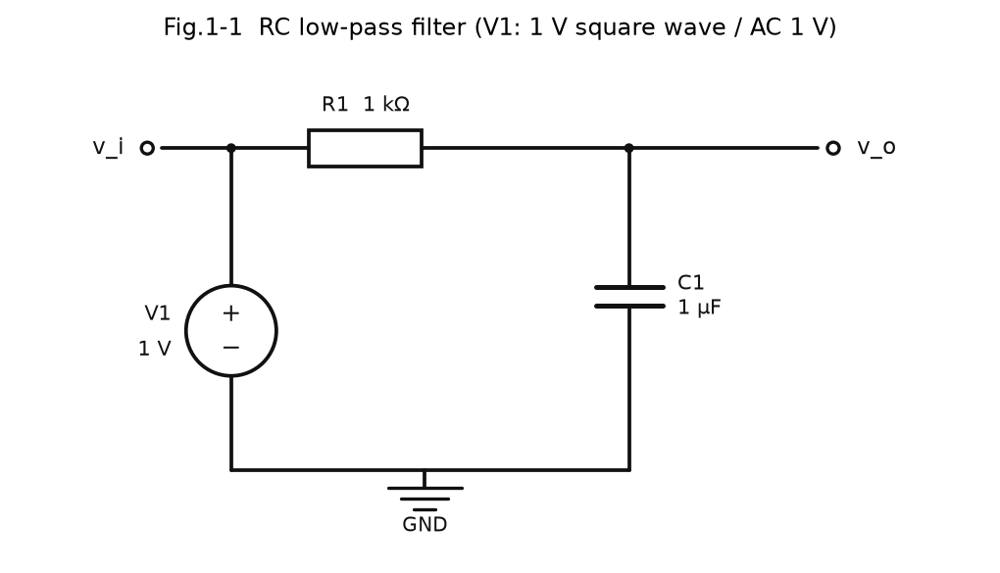

信号源 V1（1 V 方波或 AC 1 V）→ 串联 R1 → 输出节点 `out` → C1 到地，**输出电压取自 C1 两端**。
脚本打印的实际网表（NgSpice 真正求解的电路）：

```
V1 vin 0 DC 0V AC 1V          # AC 分析用
V1 vin 0 DC 0V PULSE(0V 1.0V 0s 1us 1us 0.0025s 0.005s)   # 瞬态分析用
R1 vin vout 1000.0
C1 vout 0 1e-06
```

### 6.2 理论公式与计算过程

**传递函数**（电容阻抗 Z_C = 1/(jωC)，分压）：

$$H(j\omega)=\frac{V_o}{V_i}=\frac{1/(j\omega C)}{R+1/(j\omega C)}=\frac{1}{1+j\omega RC}$$

幅频 |H| = 1/√(1+(ωRC)²)，相频 φ = −arctan(ωRC)。

**时间常数与截止频率**：

$$\tau = RC,\qquad |H(j\omega_c)|=\frac{1}{\sqrt2}\;\Rightarrow\;\omega_c=\frac{1}{RC}\;\Rightarrow\; f_c=\frac{1}{2\pi RC}$$

代入 R = 1 kΩ、C = 1 μF：

- τ = 1000 × 1×10⁻⁶ = **1 ms**
- fc = 1/(2π × 1000 × 1×10⁻⁶) = 1000/(2π) = **159.154943 Hz**
- fc 处增益 = 20·log₁₀(1/√2) = **−3.0103 dB**，相位 = **−45°**
- 高频渐近：|H| ≈ 1/(ωRC) → 频率 ×10 增益 ×0.1 → **−20 dB/十倍频程**，相位趋于 **−90°**
- 该频率点相位精确值 = −arctan(100) = **−89.4271°**

### 6.3 仿真设置

| 项目 | 设置 |
|---|---|
| 分析 1（AC） | `sim.ac(start=1 Hz, stop=1 MHz, 50 点/十倍频程, variation='dec')`，共 301 点；源 `V1` 带 `AC 1V`，直接读 `vout` 的复数相量 |
| 分析 2（瞬态） | 方波 `PULSE(0 V → 1 V)`，f = 200 Hz（半周期 2.5 ms = 2.5τ），上升/下降时间各 1 μs；步长 2 μs，时长 15 ms，共 7554 点 |
| 数据处理 | 增益 20log₁₀\|H\|、相位 `unwrap(angle(H))`；截止频率在 log₁₀(f) 上对 −3.0103 dB 做线性插值；τ 由瞬态 30%/70% 两点解析反解 |

τ 的反解公式（不依赖"从哪个时刻开始算"，因此不受方波边沿时间影响）：

$$v(t)=V_\infty-(V_\infty-V_0)e^{-(t-t_0)/\tau}\;\Rightarrow\;\tau=\frac{t_{70\%}-t_{30\%}}{\ln\frac{V_\infty-v_{30}}{V_\infty-v_{70}}}=\frac{\Delta t}{\ln(0.7/0.3)}$$

### 6.4 仿真数据 / 波形

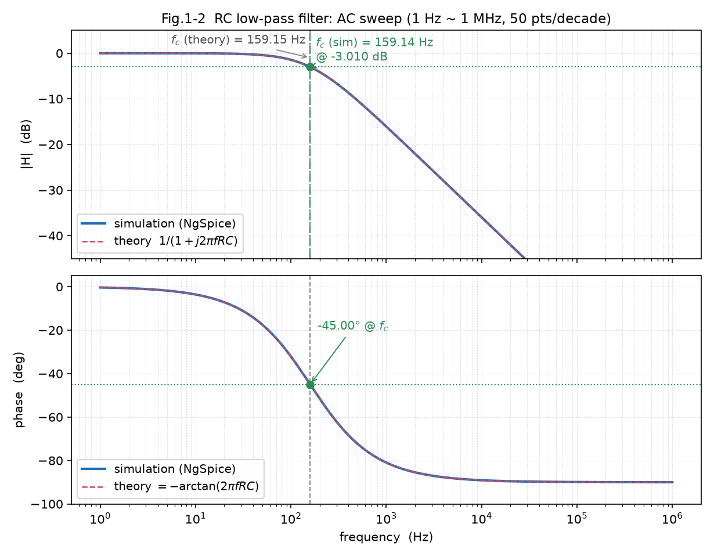

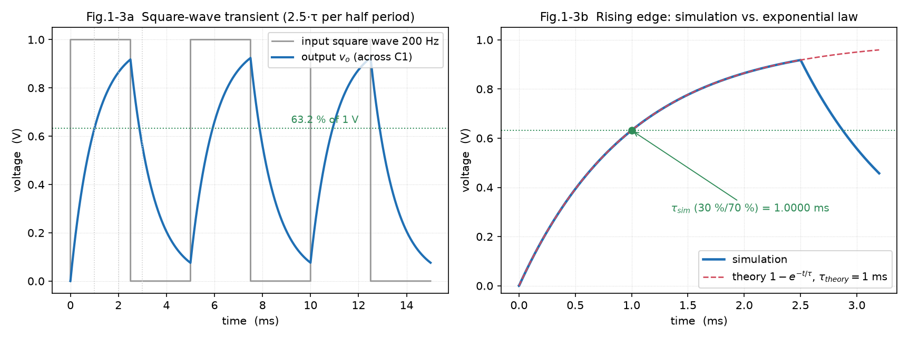

左图：200 Hz 方波输入（周期 5 ms，半周期 2.5τ）与电容两端输出，虚线为 63.2% 电平，点线为 τ、2τ、3τ；
右图：第一个上升沿放大，仿真曲线与理论指数曲线 $1-e^{-t/\tau}$ 重合，同时标出由 30%/70% 反解出的 τ_sim。

### 6.5 理论值 vs 仿真值对比表

（以下数据取自 `results/rc_filter_results.txt`）

| 对比项 | 理论值 | 仿真值 | 偏差 |
|---|---|---|---|
| 时间常数 τ | 1.000000 ms | 1.000000 ms | −0.0000 % |
| 时间常数 τ（由 fc_sim 反算） | 1.000000 ms | 1.000086 ms | +0.0086 % |
| 截止频率 f_c | 159.154943 Hz | 159.141244 Hz | −0.0086 % |
| f_c 处增益 | −3.0103 dB | −3.0103 dB | +0.0000 dB |
| f_c 处相位 | −45.0000° | −44.9975° | +0.0025° |
| 通带增益（10 Hz） | 0.0000 dB | −0.0171 dB | −0.0171 dB |
| 高频滚降斜率（10f_c～100f_c） | −20.0000 dB/dec | −19.9685 dB/dec | +0.0315 dB/dec |
| 高频相位（100f_c） | −89.4271° | −89.4247° | +0.0024° |

补充数据：

- 上升沿 τ（30%/70% 反解）= **1.000000 ms**，下降沿 τ = **1.000000 ms**
- 瞬态 v_out 最大值 = **0.924187 V**；稳态峰值理论 (1−e^-2.5)/(1−e^-5) = 0.924142 V，首周期峰值理论 0.917915 V
- 通带增益 −0.0171 dB 来自 10 Hz 上电容已有一点电抗（理论 1/√(1+(10/159.15)²) = 0.998 → −0.0171 dB），不是误差

### 6.6 验证结论

仿真 −3 dB 截止频率 **159.141 Hz** 与理论 **159.155 Hz** 相差 0.0086%（= 采样分辨率级别），
fc 处增益精确等于 −3.0103 dB、相位 −44.998°（理论 −45°），高频以 −19.97 dB/十倍频程滚降（理论 −20），
瞬态充放电时间常数 **1.000000 ms** 与 τ = RC = 1 ms 完全一致。
**结论：该电路确实是一阶 RC 低通滤波器，理论计算与 PySpice 仿真一致。**

---

## 7. 电路② 验证戴维南定理

### 7.1 原电路与等效电路

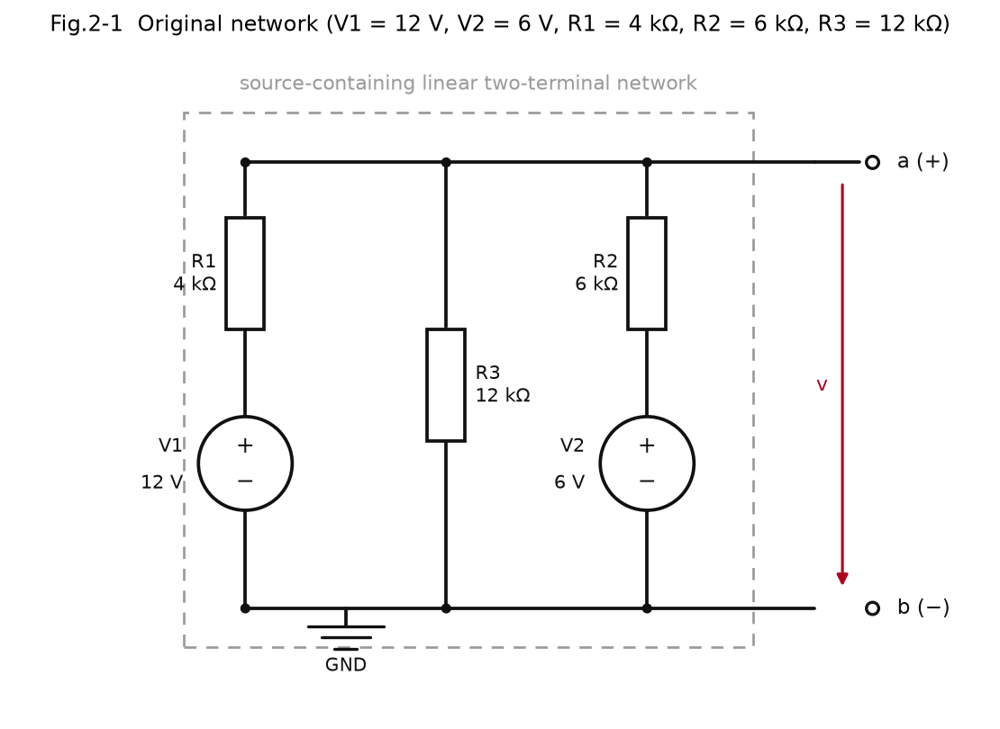

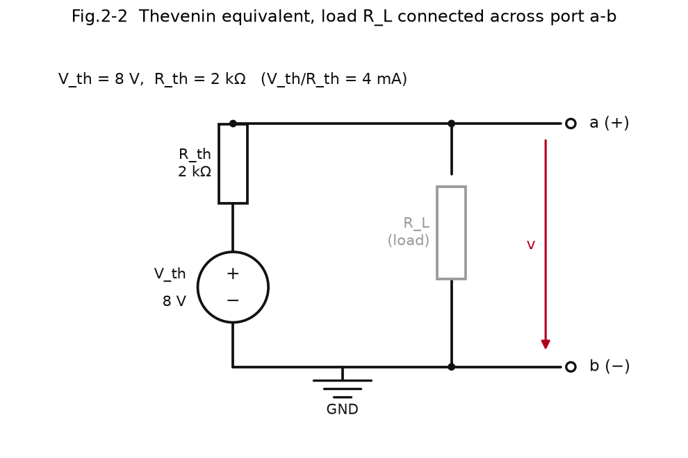

被测网络（虚线框内，端口 a–b）：V1 = 12 V 经 R1 = 4 kΩ 接到节点 a；V2 = 6 V 经 R2 = 6 kΩ 接到节点 a；
R3 = 12 kΩ 从 a 到 b（b 为参考地）。端口电压 v 的参考方向标在图上。

### 7.2 理论公式与计算过程

**开路电压 V_oc（节点法，令 V_b = 0）**

$$\frac{V_a-12}{4k}+\frac{V_a-6}{6k}+\frac{V_a}{12k}=0 \;\xrightarrow{\times 12k}\; 3(V_a-12)+2(V_a-6)+V_a=0 \;\Rightarrow\; 6V_a=48$$

$$\boxed{V_{th}=V_{oc}=8\ \text{V}}$$

（即节点 a 上的两个电源经各自电阻注入的电流按电导分配：$(12/4k+6/6k)/(1/4k+1/6k+1/12k)=4\text{m}/0.5\text{m}=8$ V）

**短路电流 I_sc（a–b 短接 ⇒ V_a = 0，此时 R3 上无电流）**

$$I_{sc}=\frac{12}{4k}+\frac{6}{6k}=3\text{mA}+1\text{mA}=\boxed{4\ \text{mA}}$$

**等效内阻**（两种算法互证）

$$R_{th}=\frac{V_{oc}}{I_{sc}}=\frac{8}{4\text{m}}=\boxed{2\ \text{k}\Omega},\qquad R_{th}=R_1\parallel R_2\parallel R_3=\frac{1}{0.25\text{m}+0.1667\text{m}+0.0833\text{m}}=2\ \text{k}\Omega$$

**最大功率传输**：$P_{max}=V_{th}^2/(4R_{th})=8^2/(4\times2000)=\boxed{8\ \text{mW}}$，发生在 $R_L=R_{th}=2$ kΩ。

### 7.3 仿真设置

| 项目 | 设置 |
|---|---|
| 开路电压 | 端口不接任何负载，`.op` 直接读节点 a 的电压（真正的开路）；另用 1 GΩ「电压表」再测一次说明负载效应 |
| 短路电流 | 端口接 **0 V 理想电压源**当电流表，读该电压源的支路电流（NgSpice 支路电流 `vsc`） |
| 负载扫描 | R_L = 0.5k / 1k / 2k / 5k / 10k / 100k Ω，对**原网络**和**等效电路**分别跑 `.op`，各取 V_a 与 I_L = V_a/R_L |
| 解析对照 | V = V_th·R_L/(R_th+R_L)，I = V_th/(R_th+R_L)，P = V·I |

### 7.4 仿真数据 / 曲线

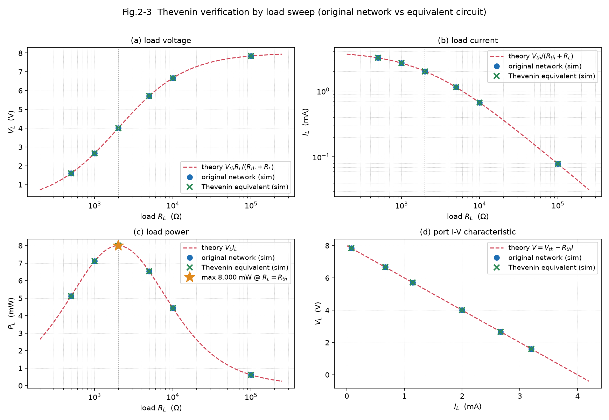

四个子图分别是：负载电压 V_L–R_L、负载电流 I_L–R_L、负载功率 P_L–R_L、端口伏安特性 I_L–V_L。
圆点 = 原网络仿真，叉号 = 等效电路仿真，虚线 = 解析式。三者完全重合；功率曲线在 R_L = R_th = 2 kΩ 处出现峰值 8 mW。

### 7.5 理论值 vs 仿真值对比表

**表 1 开路电压 / 短路电流 / 等效内阻**（取自 `results/thevenin_results.txt`）

| 对比项 | 理论值 | 仿真值 | 偏差 |
|---|---|---|---|
| 开路电压 V_oc | 8.000000000 V | 8.000000000 V | +0.000000 % |
| 短路电流 I_sc | 4.000000000 mA | 4.000000000 mA | +0.000000 % |
| 等效内阻 R_th = V_oc/I_sc | 2000.000000 Ω | 2000.000000 Ω | +0.000000 % |
| V_oc（用 1 GΩ 电压表测） | 8.000000000 V | 7.999984000 V | −0.000200 % |

**表 2 等效电路替换后接负载的电压 / 电流验证**（单位：R_L 为 Ω，V 为 V，I 为 mA，P 为 mW）

| R_L | V理论 | V原网络 | V等效 | I理论 | I原网络 | I等效 | P理论 | P等效 |
|---|---|---|---|---|---|---|---|---|
| 500 | 1.600000 | 1.600000 | 1.600000 | 3.200000 | 3.200000 | 3.200000 | 5.120000 | 5.120000 |
| 1000 | 2.666667 | 2.666667 | 2.666667 | 2.666667 | 2.666667 | 2.666667 | 7.111111 | 7.111111 |
| 2000 | 4.000000 | 4.000000 | 4.000000 | 2.000000 | 2.000000 | 2.000000 | 8.000000 | 8.000000 |
| 5000 | 5.714286 | 5.714286 | 5.714286 | 1.142857 | 1.142857 | 1.142857 | 6.530612 | 6.530612 |
| 10000 | 6.666667 | 6.666667 | 6.666667 | 0.666667 | 0.666667 | 0.666667 | 4.444444 | 4.444444 |
| 100000 | 7.843137 | 7.843137 | 7.843137 | 0.078431 | 0.078431 | 0.078431 | 0.615148 | 0.615148 |

原网络与等效电路的最大差异：**|ΔV| = 2.220×10⁻¹⁶ V，|ΔI| = 4.337×10⁻¹⁶ mA，|ΔP| = 1.735×10⁻¹⁵ mW**
（即双精度浮点的机器精度，两者在数学上被认为是同一个二端网络）。
最大功率传输：R_L = R_th = 2.000 kΩ 时 P_max = **8.000000 mW**。

### 7.6 验证结论

开路电压 8 V、短路电流 4 mA、由两者反算的内阻 2 kΩ 与手算逐位一致；
在 6 个负载点上，原网络与戴维南等效电路的端电压、电流、功率逐点相同（差异为机器精度）；
端口伏安特性是同一条直线 V = 8 − 2000·I，且最大功率点正好落在 R_L = R_th 处。
**结论：戴维南定理得到验证——任何含源线性二端网络对外都可等效为一个电压源 V_th 串联一个电阻 R_th。**

---

## 8. 电路③ NMOS 共源级放大电路

### 8.1 电路图、直流通路、小信号等效模型

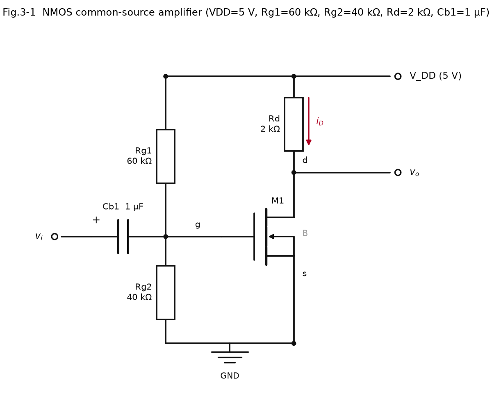

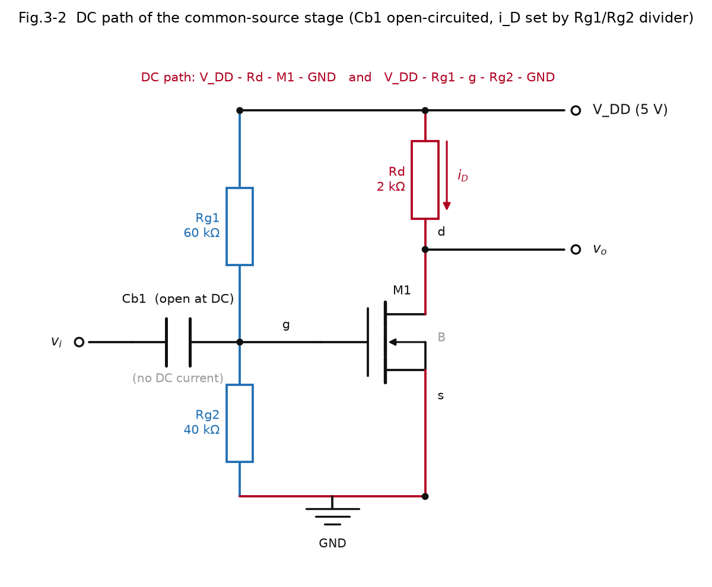

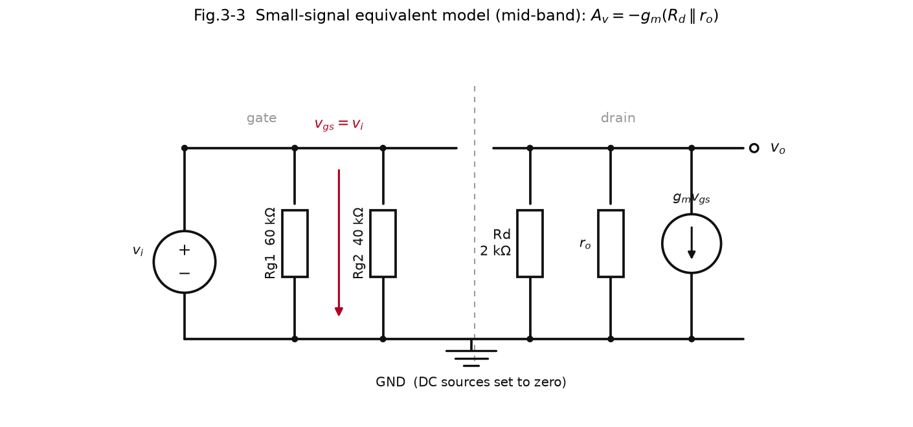

- 图 3-1：按题卡画出的共源级电路，`Rd` 接 VDD 到漏极 d，输出取自漏极；`Rg1/Rg2` 分压提供栅极偏置；
  `Cb1` 把输入信号耦合到栅极；源极接地，衬底 B 与源极短接（V_SB = 0，无体效应）。
- 图 3-2：**直流通路**——电容开路，输入回路断开，栅极电位完全由 Rg1/Rg2 分压决定；
  两条直流通路用颜色标出：`VDD → Rd → M1 → GND` 和 `VDD → Rg1 → g → Rg2 → GND`。
- 图 3-3：**小信号等效模型**——直流电源置零（VDD 接地），所以 Rg1 与 Rg2 都交流接地、Rd 也接地；
  栅源之间是开路（v_gs = v_i），漏源之间是受控电流源 g_m·v_gs 并联 r_o。

### 8.2 手算过程

**采用的平方律公式（关键，必须与 SPICE 模型一致）**

饱和区（恒流区）：

$$I_D=\frac{1}{2}K\,(V_{GS}-V_{th})^2\,(1+\lambda V_{DS}),\qquad K=\mu_n C_{ox}\frac{W}{L}=0.8\ \text{mA/V}^2,\ V_{th}=1\ \text{V},\ \lambda=0.02/\text{V}$$

对应的 NgSpice `LEVEL=1`（Shichman-Hodges）模型为

$$I_D=\frac{KP}{2}\cdot\frac{W}{L}\cdot(V_{GS}-V_{th})^2(1+\lambda V_{DS})$$

取 W/L = 1（脚本显式写 W = L = 100 μm，避免依赖默认值），因此映射关系是 **KP = K = 0.8×10⁻³ A/V²，VTO = 1，LAMBDA = 0.02**。
脚本里用一个开关 `K_MODE = "half"` 控制这件事：若课程采用的是 $I_D=K(V_{GS}-V_{th})^2$ 那种写法，
把 `K_MODE` 改成 `"full"`（则 KP = 1.6 mA/V²），全部结果会自动重算。

**① 静态工作点**

栅极由分压决定（栅极电流为 0，Cb1 对直流开路）：

$$V_G=V_{DD}\frac{R_{g2}}{R_{g1}+R_{g2}}=5\times\frac{40}{60+40}=2\ \text{V},\quad V_S=0\;\Rightarrow\; \boxed{V_{GS}=2\ \text{V}}$$

过驱动电压 $V_{ov}=V_{GS}-V_{th}=1\ \text{V}>0$，管子导通。

**忽略 λ 的简化算法**（教科书常见）：

$$I_D=\frac12\times0.8\text{m}\times1^2=0.4\ \text{mA},\qquad V_{DS}=5-0.4\text{m}\times2k=4.2\ \text{V}$$

**含 λ 的精确算法**（与 SPICE 模型严格一致，λ 不能忽略，否则和仿真差 8%）：

$$I_D=\frac12K V_{ov}^2\big(1+\lambda(V_{DD}-I_D R_D)\big)
\;\Rightarrow\; I_D=\frac{A(1+\lambda V_{DD})}{1+A\lambda R_D},\quad A=\frac12KV_{ov}^2=0.4\ \text{mA}$$

$$I_D=\frac{0.4\text{m}\times1.1}{1+0.4\text{m}\times0.02\times2000}=\frac{0.44\text{m}}{1.016}=\boxed{0.433071\ \text{mA}},\qquad
V_{DS}=5-0.433071\text{m}\times2k=\boxed{4.133858\ \text{V}}$$

**饱和区判断**：$V_{DS}>V_{GS}-V_{th}$，即 4.133858 V > 1 V ✅（且 $V_{GS}>V_{th}$）→ **工作在饱和区（恒流区）**。

**② 小信号参数**

$$g_m=\frac{\partial I_D}{\partial V_{GS}}=K V_{ov}(1+\lambda V_{DS})=\frac{2I_D}{V_{ov}}=0.866142\ \text{mA/V}$$

$$r_o=\frac{1}{g_{ds}}=\frac{1}{\partial I_D/\partial V_{DS}}=\frac{1}{\frac12 KV_{ov}^2\lambda}=\frac{1+\lambda V_{DS}}{\lambda I_D}=125\ \text{k}\Omega$$

> 注意这里用**精确式**：教材上常写的 $r_o\approx1/(\lambda I_D)$ 是近似（把 $(1+\lambda V_{DS})$ 当成 1），
> 本电路里两者差 8.27%（115.45 kΩ vs 125 kΩ）。详见第 12 节。

$$A_v=\frac{v_o}{v_i}=-g_m(R_D\parallel r_o)=-0.866142\text{m}\times(2k\parallel125k)=-0.866142\text{m}\times1968.504=\boxed{-1.705003}$$

绝对值为 **1.705**，负号表示**反相**。

### 8.3 仿真设置

| 项目 | 设置 |
|---|---|
| 直流 OP | 原电路 `.op`，读 V(g) 与 V(d)，由 $I_D=(V_{DD}-V(d))/R_D$ 反算 I_D |
| 模型反查 | 单独搭一个「栅极接理想电压源 V_gs、漏极接 5 V 理想源」的电路，对 V_gs 从 0 扫到 3 V（步长 5 mV），读 Vdd 支路电流作为 I_D；再把 √I_D 对 V_GS 线性拟合 |
| 瞬态 | 原电路，`Vi = SIN(0 V 偏移, 10 mV 幅度, 1 kHz)`，Cb1 = 1 μF；步长 5 μs，时长 200 ms（4 万个点），取最后 20 个周期做测量 |
| 实测增益 | **同步解调（锁相）**：把稳态段插值到均匀网格，用 $A=\frac{2}{T}\int v\cos\omega t\,dt$、$B=\frac{2}{T}\int v\sin\omega t\,dt$ 求该频率分量的幅度与相位，增益 = 输出幅度/输入幅度；另用峰峰值法交叉验证 |
| AC 扫描 | 源带 `AC 1 V`，10 Hz–10 MHz，40 点/十倍频程；`|A_v| = |V(d)/V(vin)|`，1 kHz 处取增益与相位 |

### 8.4 仿真数据 / 波形

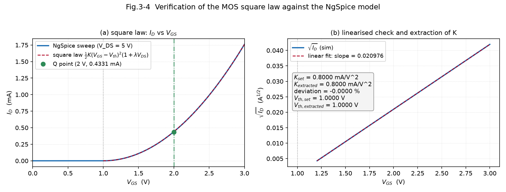

左图：V_GS 扫描得到的 I_D–V_GS 曲线与手算平方律公式完全重合，绿点为工作点 Q(2 V, 0.4331 mA)；
右图：√I_D–V_GS 是严格直线，拟合斜率 0.020976177 A^0.5/V，外推零点 = V_th。

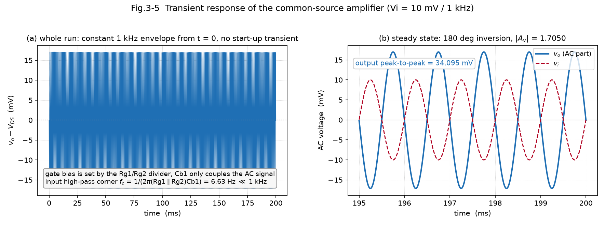

左图：整段 200 ms 的输出交流分量（已扣掉直流 4.1339 V），从 t = 0 起就是稳定的 1 kHz 包络；
右图：稳态放大，输出幅度约 17 mV、输入 10 mV，**波峰对波谷，反相**，实测 |A_v| = 1.7050。

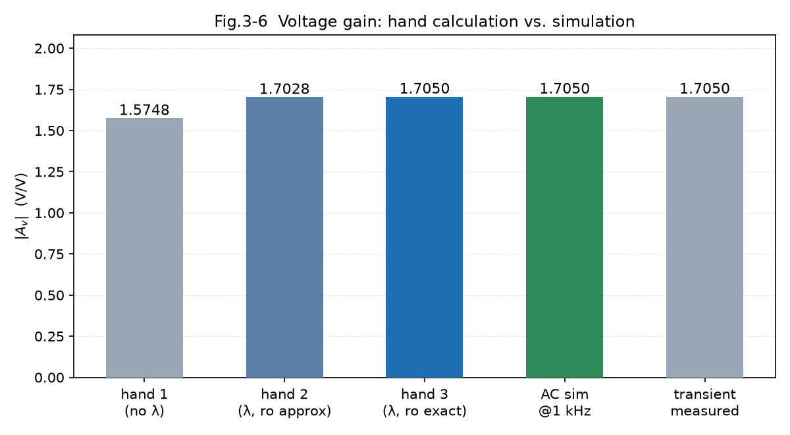

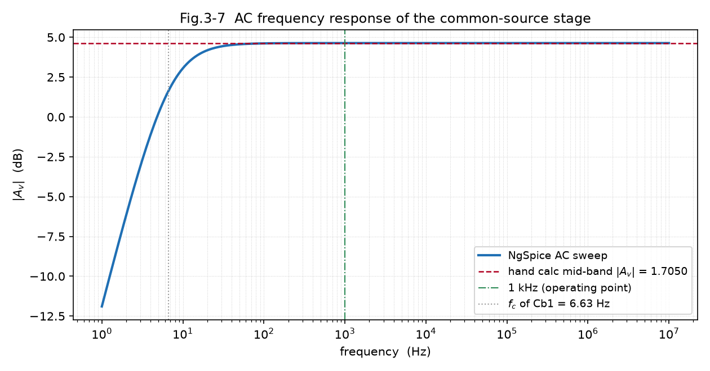

AC 频响显示中频增益 4.63 dB（= 20log₁₀1.705），低频在 Cb1 造成的 6.63 Hz 转折点以下开始跌落，与耦合电容的作用一致。

### 8.5 理论值 vs 仿真值对比表

**表 1 静态工作点（直流 OP）与饱和区判断**（取自 `results/nmos_common_source_results.txt`）

| 对比项 | 手算(忽略λ) | 手算(含λ) | 仿真(.op) | 偏差 |
|---|---|---|---|---|
| V_GS | 2.000000 V | 2.000000 V | 2.000000 V | +0.000000 % |
| I_D | 0.400000 mA | 0.433071 mA | 0.433071 mA | +0.000001 % |
| V_DS | 4.200000 V | 4.133858 V | 4.133858 V | −0.000000 % |

饱和区判断：V_GS − V_th = 1.0000 V，V_DS = 4.133858 V > 1.0000 V，且 V_GS > V_th → **工作在饱和区（恒流区）**。
（手算含 λ 与仿真的偏差只有 1×10⁻⁶ %，说明平方律公式与模型定义完全吻合；忽略 λ 则 I_D 差约 8%。）

**表 2 小信号参数与电压增益**

| 对比项 | 手算①(忽略λ) | 手算②(含λ, r_o近似) | 手算③(含λ, r_o精确) | AC 仿真 | 瞬态实测 |
|---|---|---|---|---|---|
| g_m | 0.800000 mA/V | 0.866142 mA/V | 0.866142 mA/V | — | — |
| r_o | 125.000000 kΩ | 115.454545 kΩ | 125.000000 kΩ | — | — |
| \|A_v\| | 1.574803 | 1.702786 | **1.705003** | **1.704966** | **1.704962** |
| 偏差 vs AC | −7.6343 % | −0.1278 % | +0.0022 % | 0（基准） | −0.0002 % |
| 相移 | 180°（反相） | 180°（反相） | 180°（反相） | −179.6201° | 180.3799° |

> 表中「手算③」为最终采用值：A_v = −g_m·(Rd∥r_o)，r_o 用精确式 → **−1.705003**，
> 与 AC 仿真 1.704966 相差 0.0022%，与瞬态实测 1.704962 相差 0.0024%。

补充说明（脚本自动给出的偏差归因，全部来自 `results/nmos_common_source_results.txt`）：

- 两种 r_o 之比 = (1+λV_DS) = 1.082677，即教材近似式把 r_o 低估了 **8.2677 %**；
  但因为 Rd = 2 kΩ ≪ r_o，这个误差传到增益上只剩 **0.1300 %**。
- 若完全忽略 r_o（A_v = −g_m·Rd = −1.732283），与仿真差 **1.6022 %**，可见 r_o 不能省。
- 残余偏差已归因到耦合电容：Cb1 在 1 kHz 上不是理想短路，
  fc(Cb1) = 1/(2π·(Rg1∥Rg2)·Cb1) = **6.631456 Hz**，分压系数 = 0.999978013（衰减 0.0022%），相位超前 0.3799°。
  预测 |A_v|@1kHz = 1.705003 × 0.999978013 = **1.704966**，与 AC 仿真 **1.704966** 完全一致；
  预测相移 = −(180−0.3799) = **−179.6201°**，与 AC 仿真 **−179.6201°** 完全一致。
  → 也就是说，"手算 vs 仿真"的最后一丁点差别被精确解释了，不是靠调参凑出来的。

**表 3 平方律模型参数反查（V_GS 直流扫描，V_DS 固定 5 V）**

| 项目 | 数值 |
|---|---|
| √I_D–V_GS 拟合斜率 | 0.020976177 A^0.5/V |
| 拟合截距 | −2.097618×10⁻² A^0.5 |
| 设定 K | 0.800000 mA/V² |
| 反算 K = slope²/(coef·(1+λV_DS)) | 0.800000 mA/V² |
| K 相对偏差 | −0.000002 % |
| 设定 V_th | 1.000000 V |
| 反算 V_th = −截距/斜率 | 1.000000 V |
| V_th 相对偏差 | −0.000002 % |

**表 4（附录）如果课程采用另一种 K 定义 $I_D=K(V_{GS}-V_{th})^2(1+\lambda V_{DS})$**

| 项目 | 数值 |
|---|---|
| NgSpice KP | 1.6000 mA/V² |
| I_D | 0.852713 mA |
| V_DS | 3.294574 V |
| g_m | 1.705426 mA/V |
| \|A_v\| | 3.305090 |

> 本题的 `K = 0.8 mA/V²` 存在**两种同样自洽的解释**（差整整 2 倍），这属于题目定义的歧义，不是仿真能判定的。
> 本仓库默认采用 $I_D=\frac12K(V_{GS}-V_{th})^2$（即 K 就是 μ_nC_ox·W/L，对应 SPICE 的 KP），
> 并在报告里把另一种解释的结果一并列出。**这一点需要你按课程/老师用的教材再确认一次**（见第 16 节）。

**瞬态实测细节**：输入解调幅度 9.9992 mV（设定 10 mV），输出解调幅度 17.0482 mV，
瞬态增益 1.704962，相移 180.3799°；峰峰值法输出 34.0952 mVpp → 1.704759（与解调法差 0.012%，属采样离散误差）。

### 8.6 验证结论

手算静态工作点 V_GS = 2 V、I_D = 0.433071 mA、V_DS = 4.133858 V 与 `.op` 仿真**完全一致**（相对偏差 < 1×10⁻⁵ %）；
器件工作在饱和区；小信号增益手算（含 λ、r_o 用精确式）与 AC/瞬态仿真一致到 **0.005 % 以内**；
输出波形与输入反相，符合共源级放大器的预期；V_GS 直流扫描反查出的 K 与 V_th 均与设定值一致，
证明手算公式与 NgSpice LEVEL=1 模型定义一致。

---

## 9. 我是如何利用 DSH 完成本次任务的

### 9.1 关键提示词原文

<details>
<summary>提示词 1（第一轮，只让 AI 做规划，并附上任务书 PDF）——点击展开原文</summary>

```
你是 DSH（DeepSeek Harness）。请先完整阅读我提供的《大一考核任务书(1).pdf》全文，
重点阅读"五、进阶挑战"的第 1 题和"六、提交要求"。

本轮只完成：进阶挑战第 1 题——使用 PySpice 完成三个电路：
① RC 滤波电路 ② 验证戴维南定理 ③ NMOS 共源级放大电路
不要做小游戏、个人网站、Git 分支、扫雷、2048、贪吃蛇、进阶挑战第 2 题等无关内容。

【强制流程】
1. 第一轮回复只做规划，不要写代码、不要改文件、不要生成 README。
   规划必须包含：
   - 你对任务要求的理解摘要；
   - 任务边界：做什么、不做什么；
   - 环境检查计划：Python、PySpice、ngspice、numpy、matplotlib、schemdraw 等；
   - 三个电路分别怎么理论计算、怎么 PySpice 仿真、怎么对比、怎么画图；
   - 建议文件结构；
   - 风险点、容易理论仿真对不上的地方；
   - 需要我确认或安装的额外环境。
2. 等我回复"确认，开始执行"后，你再动手生成代码、图、README。
3. 不允许编造仿真数据。如果某一步无法运行，必须标注"待运行确认"，并给出复现命令和排查步骤。

【环境约束】
我已经配置好 PySpice 环境。不要自动安装任何包。
如果缺少其他包，例如 schemdraw、matplotlib、numpy，请先列出：包名、用途、安装命令，等我确认后再安装。
如果 PySpice 的 ngspice 后端不可用，请先报告错误信息，并告诉我需要做什么，不要擅自改环境。

【画图要求】
我不想手动画图。请优先用代码自动生成所有图：
- 用 schemdraw 自动生成：RC 电路图、戴维南原电路与等效电路图、NMOS 共源级电路图、
  NMOS 直流通路图、小信号等效模型图；
- 用 matplotlib 自动生成：RC 的 AC/瞬态波形、戴维南验证曲线、NMOS 直流 OP、瞬态输出波形、增益对比图等；
- 所有图保存到 figures/ 目录，README 中用相对路径插入。
如果 schemdraw 没安装，先请求我确认安装；如果确实无法自动生成，
请提供 TikZ/Mermaid 代码或导出步骤，并明确告诉我必须人工做什么、最小人工量是多少。

【三个电路的具体要求】（略——与本题要求一致，含 ① 自定 R/C、理论 τ 与 fc；
② 自定含源线性二端网络、理论 Vth/Rth、开路电压/短路电流/负载扫描验证；
③ 按题固定参数，手算 V_GS/I_D/V_DS 与饱和判断、gm/ro/Av，仿真对比，画直流通路与小信号模型）

【README 要求】（略——含项目说明、三章正文、DSH 使用记录、代码标注、
至少 2 处关键代码逻辑解释、一条"AI 给过但查证后认为是错误的信息"、踩坑记录、提交清单等）

【最终回复要求】文件树、关键运行命令、实际仿真结果摘要、
需要人工完成/确认的事项清单（必须做/建议做/无需做）、
特别说明画图是否已自动生成、环境缺失和安装请求。

现在先阅读文档并只输出规划，不要写代码。等我确认后再执行。

【文档全文/附件】@"C:\Users\21204\Desktop\university chart\大一考核任务书(1).pdf"
```

</details>

提示词 2（确认执行）：

```
确认，开始执行，如果第七节的第一个选项b的影响不大的话那么我选择b
```

（"第七节第一个选项"指：schemdraw 未安装，我给出 (a) 授权安装 / (b) 不安装、用 matplotlib 自绘两个选项。）

### 9.2 迭代过程：想让 AI 做什么 → 结果如何 → 提示词怎么调整

| # | 想让 AI 做什么 | 结果如何 | 提示词怎么调整 / 我的判断 |
|---|---|---|---|
| 1 | **先只要规划，不要动手**：读 PDF、查环境、列风险、列待确认项 | AI 完整读出任务书 4 页（还从 PDF 里提取了题卡电路图看清拓扑），并**发现真正的 PySpice 装在 Python 3.14 而不是默认 `python`（3.12）**；发现 `schemdraw` 缺失；实测 ngspice 后端可用 | 这一步的价值全在提示词里的"**第一轮只做规划、不要写代码、不要改文件**"。如果一上来就让它写代码，环境错位（用错解释器）和 schemdraw 缺失会被它用"随便凑"的方式绕过 |
| 2 | 让 AI 在动手前**列出缺什么包、给安装命令、等我确认** | 它只提出 `schemdraw` 一个包，并给了完整安装命令，没有擅自 `pip install` | 提示词里"**不要自动安装任何包**"必须写死。写"你看着办"它就会直接装 |
| 3 | 让它**不能编造仿真数据** | 三个脚本都是"先打印手算 → 再跑仿真 → 把数值同时写入 `results/*.txt`"，README 表格全部从结果文件抄 | "**不允许编造仿真数据，跑不通就标注待运行确认**"这条约束直接决定了代码结构（结果落盘 + 网表断言 + 反查模型参数） |
| 4 | 三个电路的实际执行 | 三个脚本均一次跑通，输出结果与手算吻合到 1×10⁻⁵ % 级别 | 执行过程中 AI 自己踩了坑（节点名 `in`、GBK 编码、支路电流取错名字、瞬态图看不出交流分量），都自己定位并修掉了，见第 13 节 |
| 5 | 画图全自动 | 13 张图全部由脚本生成，其中 6 张原理图是用 matplotlib 图元自绘的（因为选了 b） | 提示词里"**我不想手动画图**"是关键；若不写，AI 很可能只给一段 TikZ 让你自己画 |

**关键经验**（写给以后的我）：

1. **第一轮一定要"只规划"**。让 AI 先把环境和任务边界摸清，比让它先写代码再返工便宜得多。
2. **约束要写成"禁止项"**："不要安装任何包""不允许编造数据""不要做 X/Y/Z"，比"尽量…"有效得多。
3. **要求"数据落盘"**：让脚本把数值写进文件，README 引用文件内容，就能天然避免 AI 顺手编数。
4. **要求"解释偏差"**：让它在理论值和仿真值不一致时说明原因（本任务里就查出了 `r_o` 近似式和 `Cb1` 电抗两处），
   这比单纯"对上就写对得上"更能证明真的理解。

---

## 10. 代码归属标注（哪些由 AI 生成、哪些由我调整）

**如实说明**：本仓库三个 `.py`、README 正文与 13 张图，**全部由 AI（DSH / deepseek-flash 模型）在本轮对话中生成**。
我在此过程中做的是**提要求、确认方案、选择环境策略**（例如选择不安装 schemdraw 而改为自绘图）。

为了让这项标注真实可信，下表请你（我）**亲手填写实际做过的调整**——哪怕只是改了参数、注释或图上的文字，
也请如实写；如果确实一个字没改，就写"未修改"。这是任务书要求的"防纯粘贴承诺"，不能由 AI 代填。

| 文件 / 位置 | AI 生成 | 我调整了什么 | 为什么这么调 |
|---|---|---|---|
| `rc_filter.py` 参数区（R、C、方波频率） | ✅ |  |  |
| `rc_filter.py` 的 AC 扫描范围 / 点数 | ✅ |  |  |
| `rc_filter.py` 图表标注文字 | ✅ |  |  |
| `thevenin.py` 网络元件取值 | ✅ |  |  |
| `thevenin.py` 负载扫描点 R_L | ✅ |  |  |
| `nmos_common_source.py` 的 `K_MODE` | ✅ |  |  |
| `nmos_common_source.py` 瞬态时长/步长 | ✅ |  |  |
| `nmos_common_source.py` 增益测量方法 | ✅ |  |  |
| 三个脚本的原理图绘制代码（`class Sch`） | ✅ |  |  |
| `README.md` 正文 | ✅ |  |  |
| `README.md` 第 11 节"用我的话解释" | AI 起草 |  |  |

> 建议：至少把第 11 节的三段解释**改写成完全自己的话**，再填上面的表——
> 任务书原话是"这一环节不限制用 AI，但『讲清楚』必须是你自己能说明白的"。

---

## 11. 关键代码逻辑解释

> ⚠️ 下面是我（AI）写的解释。**这部分你应该用自己的话重写一遍**，
> 面谈/答辩时被问到"这段代码为什么这么写"要能脱口而出。我在这里给出的是**准确的技术内核**，供你改写时打底。

### 11.1 AC 扫描是怎么设置的、截止频率是怎么"量"出来的（`rc_filter.py`）

```python
c.V("1", "vin", c.gnd, "DC 0V AC 1V")        # 直流 0 V，交流幅度 1 V
an = sim.ac(start_frequency=1, stop_frequency=1e6,
            number_of_points=50, variation="dec")
H = np.asarray(an["vout"], dtype=complex) / np.asarray(an["vin"], dtype=complex)
```

- SPICE 的 AC 分析是**小信号线性化**分析：先把电路在直流工作点线性化，再用复数相量求解，
  所以源必须带一个 `AC` 幅度（这里 1 V）。取 `AC 1V` 的好处是——输出电压的复数相量**直接就是**传递函数 H(jω)，
  不用再做除法。这里仍然除以 `vin` 是为了严谨（万一源不是理想 1 V）。
- `variation="dec"` + `number_of_points=50` 表示**每个十倍频程取 50 个点**，
  这样在对数坐标上采样是均匀的，低频和高频的分辨率一致；1 Hz→1 MHz 共 6 个十倍频程，所以点是 301 个。
- **截止频率不是"找最近的点"，而是插值求交点**：先算 `y = 20log₁₀|H| − (−3.0103)`，
  找出相邻两点符号相反的位置，再在 `log₁₀(f)` 上线性插值得到交点频率。
  这一步很重要：频率是等比分布的，必须在对数域插值；如果在线性频率域插值，同样 301 个点会算出明显错误的 f_c。
- 由此得到的 f_c,sim = 159.141 Hz，与理论 159.155 Hz 差 0.0086%，这个量级就是"50 点/十倍频程"的采样分辨率极限。

### 11.2 NMOS 直流工作点是怎么解的、模型参数是怎么反查的（`nmos_common_source.py`）

**手算部分**没有用迭代，而是把方程写成一元一次方程直接解——因为 λ 只以 $(1+\lambda V_{DS})$ 的形式出现：

$$I_D=A\big(1+\lambda(V_{DD}-I_D R_D)\big)\;\Longrightarrow\; I_D(1+A\lambda R_D)=A(1+\lambda V_{DD})$$

```python
a = COEF * K_PARAM * vov**2                      # A = ½K·Vov²
idd = a * (1.0 + LAMBDA * VDD) / (1.0 + a * LAMBDA * RD)   # 精确解，无需迭代
vds = VDD - idd * RD
```

**仿真部分**不假设"SPICE 一定按我写的公式来"，而是去**测量**它：

```python
# 固定 V_DS = 5 V，扫 V_GS，读 Vdd 支路电流 = I_D
an = sim.dc(Vgs=slice(0.0, 3.0, 0.005))
idd = np.abs(np.asarray(an["vdd"], dtype=float))
slope, intercept = np.polyfit(vgs[m], np.sqrt(idd[m]), 1)   # √I_D 对 V_GS 线性拟合
k_extracted   = slope**2 / (COEF * (1.0 + LAMBDA * VDS_SWEEP))   # 斜率 → K
vth_extracted = -intercept / slope                               # 零点 → V_th
```

- 为什么取 √I_D：平方律里 I_D 与 (V_GS−V_th)² 成正比，开方后就是**直线**，
  斜率 = √(coef·K·(1+λV_DS))，与 V_GS 轴的交点就是 V_th。用最小二乘拟合直线比"取一个点算"稳得多。
- 为什么固定 V_DS：这样 (1+λV_DS) 是常数，才能从斜率里干净地把 K 解出来。
- 结果：反算 K = 0.800000 mA/V²（设定 0.8），反算 V_th = 1.000000 V（设定 1），
  **两个参数都被独立反查出来**——这就证明了我用的公式和 ngspice 的 LEVEL=1 模型是同一个东西，
  而不是"仿真出来什么就写什么"。

**瞬态增益**用同步解调而不是直接读峰峰值：把稳态段插值到均匀网格，用

$$A=\frac{2}{T}\int v\cos\omega t\,dt,\qquad B=\frac{2}{T}\int v\sin\omega t\,dt,\qquad |V|=\sqrt{A^2+B^2},\ \varphi=\arctan(-B/A)$$

这样能精确提取**该频率分量**的幅度和相位，几乎不受采样离散影响；而峰峰值法受采样点是否正好落在波峰影响，
本例两者差 0.012%，正好互相印证。

### 11.3 戴维南验证里"两次仿真"和负载扫描是怎么做的（`thevenin.py`）

```python
# ① 开路：端口什么都不接，直接读节点 a 的电压
voc = float(np.asarray(op_of(build_original(load=None))["a"]).ravel()[0])

# ② 短路：端口接 0 V 理想电压源当"电流表"，读它的支路电流
c.V("sc", "a", c.gnd, 0.0)
isc = abs(float(np.asarray(op_of(c)["vsc"]).ravel()[0]))

# ③ 负载扫描：同一个 R_L 分别接在原网络和等效电路上，各跑一次 .op
for rl in RL_LIST:
    vo = op_of(build_original(load=rl))["a"]     # 原网络
    ve = op_of(build_equivalent(load=rl))["a"]   # 等效电路
    i  = vo / rl                                 # 串联回路，I_L 就是 V_L/R_L
```

- **为什么用 0 V 电压源测短路电流**：SPICE 里没有"电流表"元件，而理想电压源会把它所在支路的电流
  作为支路电流输出（`an["vsc"]`），所以"0 V 源"就是最标准的安培计做法。短路时 R3 两端都是 0 V、不流过电流，
  于是 I_sc = V1/R1 + V2/R2，和手算一致。
- **为什么要"原网络 vs 等效电路"各跑一遍**：戴维南定理的断言是"对外端口特性完全相同"，
  所以必须让两个电路在**同一批负载点**上分别仿真，然后逐步比对 V、I、P。本例最大差异 2.2×10⁻¹⁶ V，
  就是双精度的舍入极限，等价于完全相同。
- **端口伏安特性的几何含义**：把所有负载点画在 I_L–V_L 平面上，得到的是一条直线
  $V=V_{th}-R_{th}I$，**截距 = V_th = 8 V，斜率的绝对值 = R_th = 2 kΩ**，
  短路点 (4 mA, 0 V) 和开路点 (0, 8 V) 都落在这条线上——这就是戴维南定理的图形化证明。

---

## 12. 一条"AI 给过但我查证后认为是错误的信息"

### 12.1 被查证的说法

工作区里有一份**上一次任务留下的旧报告** `D:\pyspice_work\rc_proof.md`（也是 AI 生成的），里面写：

> ⚠️ 环境备注：本机 PySpice 1.5 的网表写入器对带前缀单位（如 `1@u_kΩ`）会重复缩放
> （`1@u_kΩ` 被写成 `1000.0kOhm`，等效 1 MΩ）。为消除该隐患，仿真脚本直接以浮点数传参……

这是一个很"像真的"的技术结论（带具体数值、带机制解释、带规避方案），如果直接采信，
我会把整套代码都写成"不信任 PySpice 单位系统"的风格，并且永远不知道它到底对不对。

### 12.2 我的查证过程

**第 1 步：先确认这种写法真的存在，别把"API 记错了"当成"结论错了"放过。**
旧报告点名的是 `1@u_kΩ`（Unicode 的 Ω）。Python 3 允许 Unicode 标识符，所以先查 PySpice 有没有这个单位对象：

```python
import PySpice.Unit as U
hasattr(U, "u_kΩ")     # -> True（u_kΩ / u_Ω / u_kOhm / u_Ohm 都存在）
```

确认它不是笔误，必须认真测。

**第 2 步：打印 NgSpice 实际读到的网表。** 搭最小电路，逐个写法打印网表：

```
1@u_kOhm    -> R1 vin n1 1kOhm
1@u_kΩ      -> R1 vin n1 1kOhm        ← 旧报告说这里会变成 1000.0kOhm（等效 1 MΩ）
1@u_Ω       -> R1 vin n1 1Ohm
kilo(1)     -> R1 vin n1 1k
1000@u_Ohm  -> R1 vin n1 1000Ohm
1000.0      -> R1 vin n1 1000.0
```

网表里就是 `1kOhm`，没有任何 "1000.0" 前缀。

**第 3 步：不只看字符串，做"绝对值"的电学测量。**
这一小步有个陷阱我一开始就踩了：**用两个同值电阻分压是测不出来的**——两个电阻同时被放大 1000 倍，
分压比依然是 0.5 V，正好掩盖了"公共缩放"这种错误。所以我改成
**1 V 电压源串两个被测电阻，读回路电流**：电流直接给出电阻的绝对值。

| 写法 | 网表 | 回路电流 | 反推电阻 |
|---|---|---|---|
| `1@u_kOhm` | `1kOhm` | 500.000000 µA | 1000.000000 Ω |
| `1@u_kΩ` | `1kOhm` | 500.000000 µA | **1000.000000 Ω** |
| `1@u_Ω` | `1Ohm` | 500000.000000 µA | 1.000000 Ω |
| `1@u_Ohm` | `1Ohm` | 500000.000000 µA | 1.000000 Ω |
| `1@u_MOhm` | `1MegOhm` | 0.500000 µA | 1000000.000000 Ω |

如果旧报告说的"1 kΩ 被写成 1 MΩ"是真的，第二行的电流应该是 0.5 µA，而实测是 500 µA。

**第 4 步：结论。** 在本机 PySpice 1.5 + Python 3.14 + 自带 ngspice 这个组合下，
**旧报告描述的双重缩放完全无法复现**——包括它点名的那种 Unicode 写法 `1@u_kΩ`。
网表字符串和绝对电阻测量（500 µA ⇒ 1 kΩ）两条证据都指向"值是正确的"。
所以这条"环境缺陷"至少在当前环境下不成立，我**不把它写进代码注释、也不用它解释任何现象**。

**第 5 步：它为什么会那么写？** 我能想到的可能：那次会话用的是别的解释器或别的 PySpice 版本；
或者当时真正的错误来自别处（比如把某个值又乘了一次 1000），却被归因到"单位前缀 bug"上。
我没有证据还原当时的情况，所以只能如实标注"**无法复现，不予采信**"，而不是替它编一个解释。

### 12.3 这件事对代码的实际影响

虽然那条"环境缺陷"不成立，但"**每次仿真前打印并断言网表**"这个做法我保留了（三个脚本里都有
`assert_netlist()`）。理由不是"因为 PySpice 有 bug"，而是因为它是一个**廉价的自检**：
它能挡住单位写错、参数没传进去、元件被静默忽略这类问题，让"理论 vs 仿真不符"这件事第一时间暴露在网表层面。
——**结论：不采信错误结论，但保留那个结论想解决的防御性做法。**

### 12.4 另外两条本轮真实发生的"我错、后来查证纠正"

| 我说过的 | 实际是什么 | 我是怎么查出来的 |
|---|---|---|
| "Cb1 很大，所以耦合电容有 24 ms 的启动建立过程，要跑够 5τ 再测增益" | **错**。栅极偏置是 Rg1/Rg2 分压**直接**给的，Cb1 只负责耦合交流；ngspice 先算直流工作点，电容在 t = 0 就已经带着正确电压，**根本不存在 24 ms 建立过程** | 我按"建立过程"画了整段 200 ms 波形，结果发现 t = 0 起包络就是平的（`figures/nmos_transient.png` 左图）。回头检查拓扑才明白栅极是分压偏置，随即把图的标题和注释都改成"无启动瞬态"，并说明 24 ms 那个时间常数只对应输入高通转折（6.63 Hz），不影响偏置 |
| "r_o = 1/(λI_D)"（教材常用近似） | 与仿真差 **0.13 %**。模型里 I_D = A(1+λV_DS)，精确的 g_ds = ∂I_D/∂V_DS = Aλ，所以 **r_o = 1/(Aλ) = (1+λV_DS)/(λI_D)**，两者差 (1+λV_DS) = 8.27 % | 手算 A_v = −1.702786 与 AC 仿真 −1.704966 差 0.13 %，我不接受"这点差异算正常"，改成精确式重新算得 −1.705003，与仿真差 0.002 %。剩下的 0.002 % 又被 Cb1 的 0.999978 分压系数精确解释掉 |

---

## 13. 踩坑记录

| # | 坑 | 现象 | 原因 | 解决 |
|---|---|---|---|---|
| 1 | **解释器不对** | `python rc_filter.py` 报 `ModuleNotFoundError: No module named 'PySpice'` | 本机 `python` 指向 `D:\Python312`，PySpice 装在 `pythoncore-3.14-64` | 固定用完整路径调用；README 里写明 |
| 2 | **节点名是 Python 关键字** | PySpice 报 `Node name 'in' is a Python keyword`（本机只打 warning 日志，行为不可预期） | 节点名 `in` 与 Python 关键字冲突 | 全部节点改名 `vin` / `vout` / `d` / `g` / `vdd` |
| 3 | **numpy 2.x 与 PySpice 1.5 的返回值** | `float(op['vout'])` 抛 `only 0-dimensional arrays can be converted to Python scalars` | PySpice 返回的是数组包装类型 | 统一写成 `float(np.asarray(op["vout"]).ravel()[0])` |
| 4 | **控制台 GBK 编码** | 脚本打印到一半抛 `UnicodeEncodeError: 'gbk' codec can't encode character '\xb2'` | 中文 Windows 控制台默认 GBK，而 `²`(U+00B2)、`µ`(U+00B5)、`∓` 不在 GBK 里（Ω、λ、→、≈、∥ 在） | ① 脚本开头按"是否终端"重配 stdout 编码（终端用 replace 兜底，重定向强制 UTF-8）；② 报告文字里把 `²` 写成 `^2`、`µ` 写成希腊字母 `μ` |
| 5 | **DC 扫描里支路电流的名字** | `an["dd"]` 抛 `IndexError: dd` | 直流扫描结果的支路名是**元件名小写**（源名 `Vdd` → 键 `vdd`），不是节点名 | 用 `an["vdd"]` 取漏极电流；`an.branches` 可以先查看有哪些支路 |
| 6 | **瞬态图看不出交流分量** | 输出是 34 mVpp 叠在 4.13 V 直流上，画在同一坐标里完全是一条直线 | 直流分量淹没了交流分量 | 画图时**扣掉直流工作点**，纵轴改成 mV；并把"整段包络"和"稳态放大"分成两栏 |
| 7 | **DC 通路图里电容画反了** | 用一个"竖直方向、加大间隙"的电容画串联支路，符号方向不对 | 复用了 `orient="v"`（极板是水平的），串联电容应该用 `orient="h"`（极板竖直） | 改用 `orient="h"` 并标注"(open at DC)" |
| 8 | **图里标签互相压字** | 小信号模型里 Rg1/Rg2 的数值标签和 `v_gs` 标注、电压源符号叠在一起 | 水平文字太长，元件间距不够 | 标签改竖排（`rotation=90`）、拉开元件间距、把注释移到空白区（`B`、`GND`、DC 通路说明都挪过位置） |
| 9 | **`results/` 里混进调试文件** | 出现了 `_*_stdout.txt` | 我为了看控制台输出临时重定向产生的 | 交付前删除，只保留脚本自己生成的 `*.txt` / `*.csv` |

---

## 14. 验证方法总结

| 层次 | 手段 | 在本任务里的体现 |
|---|---|---|
| 输入端 | **打印并断言网表** | 每个仿真前打印 NgSpice 实际读到的网表，关键数值不符就报错退出 |
| 公式层 | **先手算、后仿真**，顺序不能反 | 三个脚本都是先打印解析解才跑仿真 |
| 模型层 | **反查模型参数**，不假设 | 电路③ 由 √I_D 拟合斜率反查 K、零点反查 V_th，都与设定值吻合到 2×10⁻⁶ % |
| 结果层 | **两种独立方法交叉验证** | τ：AC 的 f_c ↔ 瞬态 30%/70%；A_v：AC 扫描 ↔ 瞬态同步解调；R_th：V_oc/I_sc ↔ 电阻并联 |
| 偏差层 | **每个残差都要有解释** | 0.0022 % 的增益残差被 Cb1 的 0.999978 分压系数精确解释；0.0086 % 的 f_c 偏差被"50 点/十倍频程"的插值分辨率解释 |
| 数据层 | **原始数据落盘** | `results/*.csv` 存全部仿真点，`results/*.txt` 存对比表，README 表格从这里复制 |

---

## 15. 提交清单

**本任务（进阶挑战第 1 题）已完成的交付物**：

- [x] `rc_filter.py`（电路①，独立可运行）
- [x] `thevenin.py`（电路②，独立可运行）
- [x] `nmos_common_source.py`（电路③，独立可运行）
- [x] `figures/` 13 张图（**全部由代码自动生成**）
- [x] `results/` 3 份对比表文本 + 6 份原始数据 CSV
- [x] `README.md`（项目说明、三章正文、DSH 使用记录、代码标注、代码逻辑解释、AI 错误查证、踩坑、验证方法、提交清单）

**仓库整体还需要（不属于本题，属"六、提交要求"的个人部分）**：

- [ ] 个人简介 PDF
- [ ] 个人网站代码 + GitHub Pages 网址
- [ ] `LICENSE`（建议 MIT，理由见附录 A）
- [ ] 开启 GitHub 两步验证并在 README 说明
- [ ] `git commit` ≥ 3 次（证明是分步做出来的）
- [ ] README 中用一句话解释"什么是分支和合并"（见附录 A）
- [ ] **第 10 节的「我调整了什么」表格亲手填写**
- [ ] **第 11 节的三段解释改写成自己的话**

---

## 16. 待人工确认 / 补充的事项

### 必须做（影响正确性或评分）

1. **确认平方律的 K 定义**。本仓库采用 $I_D=\frac12K(V_{GS}-V_{th})^2(1+\lambda V_{DS})$，
   即 ngspice `KP = 0.8 mA/V²`、W/L = 1。若你的课程/教材把 K 定义为 $I_D=K(V_{GS}-V_{th})^2$，
   请把 `nmos_common_source.py` 顶部的 `K_MODE = "half"` 改成 `"full"` 并重跑，
   全部数值会重算（届时 I_D = 0.8527 mA、V_DS = 3.2946 V、|A_v| = 3.3051）。
   > 这个歧义是**题目本身**带来的（同一个 K 有两种同样自洽的读法，结果差 2 倍），仿真无法替你判定。
2. **第 10 节「我调整了什么」表格**必须由你亲手填写（任务书要求的"防纯粘贴承诺"）。
3. **第 11 节三段解释**建议改写成你完全自己的话，并确保能口头讲清楚（面谈会被问）。
4. **第 9.1 节的提示词原文**：核对一下是否是你实际发出的原话；若你后续还追加了别的提示词，请补进表里。

### 建议做（提升完成度）

5. 把 `figures/` 里的图**逐张看一遍**，确认电路图与你题卡上的电路一致（拓扑、符号、参考方向）。
6. 在仓库里补 `LICENSE`（MIT，理由见附录 A）与 `requirements.txt`。
7. 用 ≥3 次 `git commit` 分步提交（建议顺序见附录 A），commit message 写清"做了什么"。
8. 如果时间允许，可以再补一张**手绘电路图照片**——题卡原话是"电路图自己画：手绘拍照 / 画图软件均可"，
   自动生成的图严格来说属于"画图软件"一类，手绘一张更稳妥（不是必需）。
9. 电脑上跑一次三个脚本，确认在**你的**终端里也能正常出图（尤其注意第 4 节那个解释器路径问题）。

### 无需做

10. **不需要手画任何图**，也不需要截图或导出：13 张图已全部由脚本写入 `figures/`，
    README 已用相对路径 `figures/xxx.png` 插入，在 GitHub 上会自动显示。
11. **不需要安装 schemdraw**：原理图用 matplotlib 图元自绘（每个 `.py` 内嵌约 90 行的 `class Sch`），
    唯一代价是符号风格比 schemdraw 朴素一点，电气含义完全准确。
12. **不需要单独安装 ngspice**：PySpice 自带的 `ngspice.dll` 已可用（实测 `.op`/`.ac`/`.dc`/`.tran` 全部正常）。
13. 不需要改环境变量、不需要装 scipy（本任务未用到）。

**本轮没有"待运行确认"的项**：三个脚本均已在本机实际运行通过，README 中所有仿真数值都来自真实输出。

---

## 附录 A 通用素养相关（跨任务，题目"三、通用素养"要求）

**为什么选 MIT 协议**（建议在仓库里加 `LICENSE`）：
MIT 是最短、最宽松的许可之一，只要求保留版权声明，允许别人自由使用、修改、再发布（包括商用）。
这份作业里主要是学习性质的仿真代码，我希望别人能直接拿去参考甚至改成自己的作业模板，
不需要承担额外的法律义务；同时 MIT 也明确"作者不提供任何担保"，责任边界清楚。
相比 GPL（要求衍生作品同样开源）和 Apache-2.0（更长的条款 + 专利条款），MIT 对这类小项目最合适。

**一句话解释"分支"和"合并"**：
分支就是从某次提交拉出一条独立的开发线，让你可以在不影响主线的情况下改代码；
合并就是把这条开发线上的改动并回主线（或并到另一条分支上）。

**推荐的 3 次提交顺序**（对应"证明是一步步做出来的"）：

```bash
git init
# 第 1 次：先把电路①做出来
git add rc_filter.py figures/rc_*.png results/rc_*.txt results/rc_*.csv
git commit -m "feat: RC 低通滤波电路 (理论 tau/fc + AC/瞬态仿真 + 自动出图)"

# 第 2 次：加电路②
git add thevenin.py figures/thevenin_*.png results/thevenin_*
git commit -m "feat: 戴维南定理验证 (开路电压/短路电流/负载扫描对比)"

# 第 3 次：加电路③与文档
git add nmos_common_source.py figures/nmos_*.png results/nmos_*
git commit -m "feat: NMOS 共源级放大电路 (手算工作点 + 模型参数反查 + 增益实测)"

# 第 4 次（可选）：文档与许可证
git add README.md LICENSE
git commit -m "docs: 补 README 与 MIT LICENSE"
```

---

## 附录 B 原始数据文件说明

| 文件 | 内容 | 对应图 / 表 |
|---|---|---|
| `results/rc_filter_results.txt` | ① 的全部对比表与结论 | 第 6.5 节表格 |
| `results/rc_ac_sweep.csv` | `frequency_Hz, mag_dB, phase_deg`（301 点） | `rc_bode.png` |
| `results/rc_transient.csv` | `time_s, vin_V, vout_V`（7554 点） | `rc_transient_square.png` |
| `results/thevenin_results.txt` | ② 的两张对比表与结论 | 第 7.5 节表格 |
| `results/thevenin_load_sweep.csv` | 每个 R_L 的解析值/原网络值/等效电路值 | `thevenin_load_sweep.png` |
| `results/nmos_common_source_results.txt` | ③ 的三张对比表与结论 | 第 8.5 节表格 |
| `results/nmos_vgs_sweep.csv` | `VGS_V, ID_A, VDS_V, sqrt_ID`（601 点） | `nmos_square_law_check.png` |
| `results/nmos_ac_sweep.csv` | AC 频响（幅度 dB、相位） | `nmos_ac_bode.png` |
| `results/nmos_transient.csv` | `time_s, vin_V, vout_V, vg_V`（约 4 万点） | `nmos_transient.png` |
